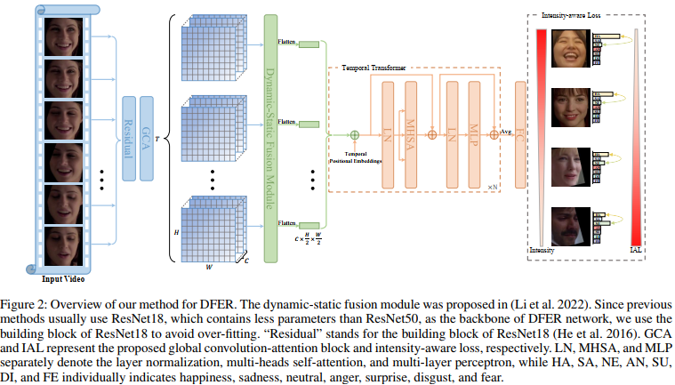

# IAL-for-Facial-Expression-Recognition
Dynamic Facial Expression Recognition

```bash
main.py -- contains the code of the proposed intensity-aware loss

modules.py -- contains the code of the proposed global convolution-attention block

video_transform.py \& dataset_DFEW.py -- contain the code of the data augmentation and the dynamic sampling strategy used in our methods

final_model.py -- is just used to build the overall model based on ''modules.py''
```
# Training on DFEW dataset
```bash
# begin training and evaluation
python main.py
```

# Citation
If you find our work useful, please consider citing our paper:
```bash
@inproceedings{li2022intensity,
  title={Intensity-Aware Loss for Dynamic Facial Expression Recognition in the Wild},
  author={Li, Hanting and Niu, Hongjing and Zhu, Zhaoqing and Zhao, Feng},
  booktitle={Proceedings of the AAAI conference on artificial intelligence},
  year={2023}
}
```
